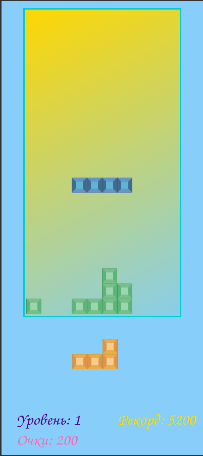
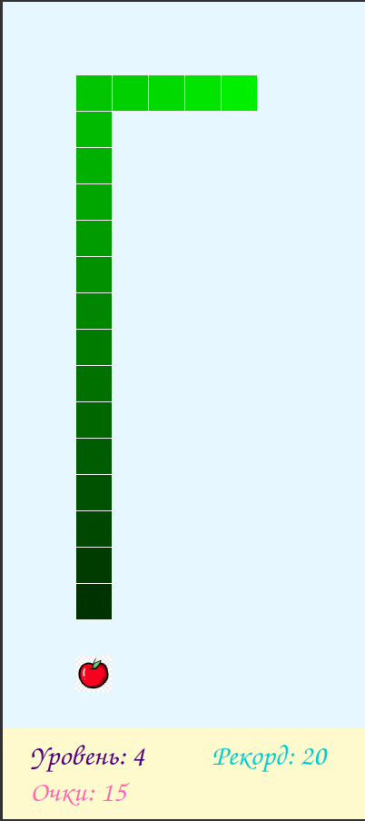

# BrickGame: Tetris + Snake (CLI + Qt)

Проект с двумя классическими играми: **Tetris** и **Snake**.
Есть терминальная версия (ncurses) и GUI-версия на Qt с лаунчером выбора игры.

## Скриншоты

### Tetris

### Snake

## Возможности

- Две игры в одном проекте: Tetris и Snake.
- Терминальный интерфейс на `ncurses` (CLI).
- GUI на Qt: лаунчер выбора игры и отдельные окна для Tetris/Snake.
- High score сохраняется в `$HOME/highscore.txt` (отдельные записи для Tetris и Snake).
- Поддержаны тесты (GTest) и отчёт покрытия (lcov/genhtml) через Makefile.

## Сборка и запуск

### CLI (терминал)

Сборка:
make

Запуск:
./s21_brick_game_terminal_sue_annel
### Qt (GUI)

Сборка Qt-версии:
make qt

Очистка Qt-артефактов:
make qtclean

## Управление

### Tetris (CLI / ncurses)

- `A` или `←` — влево.
- `D` или `→` — вправо.
- `S` или `↓` — вниз (ускорить падение на шаг).
- `Space` — поворот фигуры.
- `Esc` — пауза (toggle).
- `Q` / `q` — выход из игры.

Экран Game Over:
- `Enter` — начать заново (reset).
- `Esc` — выйти.

### Tetris (Qt)

- `←` — влево.
- `→` — вправо.
- `↓` — вниз.
- `↑` или `Space` — поворот.
- `Esc` — пауза.
- `Q` — выход.

Если игра окончена (Game Over), нажатие клавиши сбрасывает игру и продолжает.

### Snake (CLI / ncurses)

- Стрелки `← ↑ → ↓` — движение змейки.
- `Esc` — пауза (toggle).
- `Space` — ускорение (boost; работает пока клавиша нажата).
- `Q` / `q` — завершить игру (выход).

### Snake (Qt)

- `Enter` — старт со стартового экрана.
- `Esc` — в меню выбора игры со стартового экрана.
- `Esc` во время игры — пауза (toggle).
- Стрелки `← ↑ → ↓` — движение (если не пауза).
- `Space` — ускорение (boost; при отпускании отключается).

## Makefile цели

- `make` / `make all` — сборка терминальной версии.
- `make install` — установка в `$HOME/bin`.
- `make uninstall` — удаление из `$HOME/bin`.
- `make test` — запуск unit-тестов (GTest) в режиме `TESTMODE`.
- `make gcovreport` — отчёт покрытия (lcov + genhtml).
- `make check` — clang-format и cppcheck.
- `make clean` — очистка артефактов сборки.
- `make qt` / `make qtclean` — сборка/очистка Qt-версии.

## Структура проекта (кратко)

- `brickgametetrismodel/` — core-логика Tetris (фигуры, коллизии, линии, скоринг).
- `brickgametetriscontroller/` — обработка ввода/пауза/Game Over для Tetris (CLI).
- `brickgamesnake*` — модель/контроллер Snake для CLI и Qt.
- `guicli/` — отрисовка в терминале и welcome-экран.
- `guidesktoplauncher/` — Qt-лаунчер выбора игры.
- `images/` — изображения для README (tetris.png, snake.png).

## Требования

- C/C++ toolchain.
- `ncurses` для CLI.
- Qt + `qmake` для GUI.
- GTest для `make test`.
